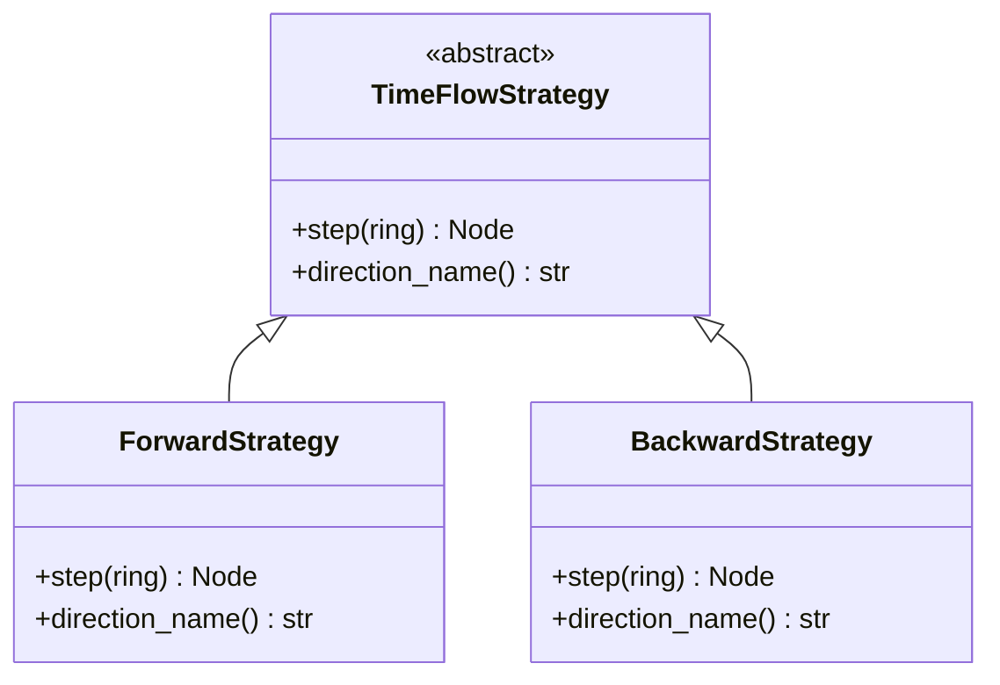
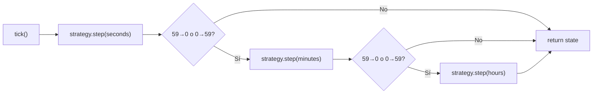
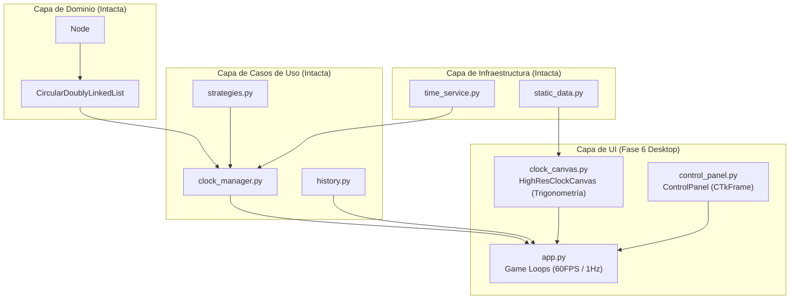

# Tick Node — Walkthrough de Implementación

---

## Fase 1: El Núcleo Puro (Capa de Dominio) ✅

### Objetivo
Crear las estructuras de datos estrictas y matemáticamente correctas, cumpliendo SRP.

### Archivos implementados

#### [entities.py](file:///c:/Users/Gabriel/Desktop/Tareas/EstructurasDatos/TickNode/tick_node_app/src/domain/entities.py)

**Clase `Node`** — Atributos `data`, `prev`, `next` con `__slots__`. Auto-enlace al nacer.

**Clase `CircularDoublyLinkedList`** — Anillo cerrado desde el constructor.

| Método | O() | Descripción |
|---|---|---|
| `__init__(values)` | O(n) | Anillo ya cerrado — último → primero |
| `advance_forward()` | O(1) | Cursor `.current` un paso adelante |
| `advance_backward()` | O(1) | Cursor un paso atrás |
| `find(target)` | O(n) | Busca valor; `KeyError` si no existe |
| `set_current(target)` | O(n) | Mueve cursor al valor dado |
| `to_list()` / `__iter__()` | O(n) | Extracción de datos sin print |

**Reglas cumplidas:** ✅ Cero `None` · ✅ Cero `print()` · ✅ Cero `if node is None`

#### [test_domain.py](file:///c:/Users/Gabriel/Desktop/Tareas/EstructurasDatos/TickNode/tick_node_app/tests/test_domain.py) — **30 tests passed**

---

## Fase 2: Infraestructura y Datos ✅

### Archivos implementados

#### [static_data.py](file:///c:/Users/Gabriel/Desktop/Tareas/EstructurasDatos/TickNode/tick_node_app/src/infrastructure/static_data.py)

**`WATCH_BRANDS`** — 5 marcas de lujo:

| Marca | Estilo | Fondo | Marcadores |
|---|---|---|---|
| Rolex Submariner | Baton | `#0B1A2E` | Dorado `#C4A34D` |
| Patek Philippe Calatrava | Roman | `#FAF6F0` | Negro `#2C2C2C` |
| Audemars Piguet Royal Oak | Baton | `#1B2838` | Blanco `#FFFFFF` |
| Omega Speedmaster | Arabic | `#1C1C1C` | Beige `#F5F5DC` |
| Cartier Tank | Roman | `#FFFFF0` | Azul `#00008B` |

**`TIME_ZONES`** — 26 zonas IANA agrupadas por continente.

#### [time_service.py](file:///c:/Users/Gabriel/Desktop/Tareas/EstructurasDatos/TickNode/tick_node_app/src/infrastructure/time_service.py)

**`TimeCalculator`** — `hour_difference(dest, origin)` → `int`. Cero APIs externas.

#### [test_infrastructure.py](file:///c:/Users/Gabriel/Desktop/Tareas/EstructurasDatos/TickNode/tick_node_app/tests/test_infrastructure.py) — **14 tests passed**

---

## Fase 3: Engranajes y Lógica de Negocio ✅

### Archivos implementados

#### [strategies.py](file:///c:/Users/Gabriel/Desktop/Tareas/EstructurasDatos/TickNode/tick_node_app/src/use_cases/strategies.py) — Patrón Strategy



#### [clock_manager.py](file:///c:/Users/Gabriel/Desktop/Tareas/EstructurasDatos/TickNode/tick_node_app/src/use_cases/clock_manager.py) — El Orquestador



| Método | Descripción |
|---|---|
| `tick()` | Avanza segundos + cascada Observer a min/hrs |
| `shift_time_zone(int)` | Mueve solo puntero de horas N posiciones |
| `get_state()` | Dict `{hours, minutes, seconds, direction}` |
| `toggle_time_machine()` | Intercambia Forward ↔ Backward |

#### [test_use_cases.py](file:///c:/Users/Gabriel/Desktop/Tareas/EstructurasDatos/TickNode/tick_node_app/tests/test_use_cases.py) — **26 tests passed**

---

## Fase 4: Fábricas Visuales e Historial ✅

### Archivos implementados

#### [history.py](file:///c:/Users/Gabriel/Desktop/Tareas/EstructurasDatos/TickNode/tick_node_app/src/use_cases/history.py) — Pila LIFO

**Clase `HistoryStack`** — Stack clásico con lista nativa de Python.

| Método | Descripción |
|---|---|
| `push(item)` | Apila un registro de viaje |
| `pop()` | Desapila y retorna el último viaje (para "Deshacer") |
| `peek()` | Lee el tope sin desapilar |
| `is_empty()` | `True` si la pila está vacía |
| `__len__()` | Cantidad de viajes en el historial |

Cada item apilado: `{"from": "America/Bogota", "to": "Asia/Tokyo", "diff": 14}`

#### [watch_faces.py](file:///c:/Users/Gabriel/Desktop/Tareas/EstructurasDatos/TickNode/tick_node_app/src/ui/watch_faces.py) — Patrón Factory

**Clase `WatchFaceFactory`** — Construye figuras Plotly de relojes analógicos.

| Componente | Detalle |
|---|---|
| Dial | Círculo con fondo + bisel usando `go.Scatter(fill="toself")` |
| Marcadores | 3 estilos: `baton` (líneas), `roman` (I–XII), `arabic` (1–12) |
| Ticks minuto | 60 líneas pequeñas (excluye posiciones de hora) |
| Manecillas | 3 líneas con contrapeso: hora (0.50r), minuto (0.70r), segundo (0.80r) |
| Ángulos | `s*6°`, `m*6° + s*0.1°` (smooth), `h*30° + m*0.5°` (smooth) |
| Centro | Punto pivote con `go.Scatter(mode="markers")` |

> [!TIP]
> Las manecillas tienen **smooth sweep** — la manecilla de hora se mueve gradualmente con los minutos, y la de minutos con los segundos.

---

## Fase 5: Ensamblaje Frontend (Streamlit) ✅

### Archivo implementado

#### [app.py](file:///c:/Users/Gabriel/Desktop/Tareas/EstructurasDatos/TickNode/tick_node_app/app.py) — Punto de entrada

**Session State** — Inicializa una sola vez por sesión:
- `ClockManager` (sincronizado con hora real)
- `HistoryStack` (vacío)
- `brand_key` (default: "rolex")
- `current_zone` (detectado del sistema)
- `time_machine_on` / `auto_tick` (flags)

**Sidebar — Panel de Control:**

| Control | Acción |
|---|---|
| 🏷️ Marca de Lujo | Dropdown → cambia el estilo visual (Factory) |
| 🌍 Zona Horaria | Dropdown → calcula `hour_difference()`, ejecuta `shift_time_zone()`, push al `HistoryStack` |
| ⏪ Deshacer Viaje | Pop de la pila, aplica `shift_time_zone(-diff)` |
| ⏳ Máquina del Tiempo | Toggle → `toggle_time_machine()` (Forward ↔ Backward) |
| ⚡ Tick ×1 / ×60 | Botones manuales |
| Tick automático | Toggle → `st_autorefresh` cada 1 segundo |

**Área Principal:**
- Header "🕐 Tick Node"
- Reloj Plotly renderizado con `st.plotly_chart()`
- Readout digital monospace debajo
- Zona horaria actual

### Captura de la App Funcionando


---

## Fase 6: Refactor a Desktop App (CustomTkinter) ✅

> [!IMPORTANT]  
> Debido a limitaciones de rendimiento y refresco en Streamlit para lograr una animación a 60 FPS fluida, se decidió hacer un refactor completo de la UI. El backend (Domain, Use Cases, Infrastructure) se mantuvo 100% INTACTO. Se rediseñó puramente la capa de Presentación para migrar de una Web App a una Desktop App nativa de alto rendimiento.

### Archivos implementados

#### [clock_canvas.py](file:///c:/Users/Gabriel/Desktop/Tareas/EstructurasDatos/TickNode/tick_node_app/src/ui/clock_canvas.py) — Render Engine

**Clase `HighResClockCanvas`** — Reemplaza el anterior `watch_faces.py` (Plotly).
- **Trigonometría Avanzada**: Uso intensivo de `math.cos` y `math.sin` para posicionar marcadores y manecillas.
- **Smooth Sweep a 60 FPS**: Calcula ángulos fraccionales interpolando milisegundos (`frac_sec`) para evitar el "salto" clásico de los segundos.
- **Diseños de Lujo en Polígonos**: Renderiza manecillas complejas ("Mercedes" con el círculo perforado y "Sword" tipo diamante) usando `create_polygon`.

#### [control_panel.py](file:///c:/Users/Gabriel/Desktop/Tareas/EstructurasDatos/TickNode/tick_node_app/src/ui/control_panel.py) — El Sidebar Moderno

**Clase `ControlPanel`** — Hereda de `CTkFrame`.
- UI minimalista con bordes redondeados (`customtkinter`).
- Textos estrictamente en **Español** para la interacción de usuario.
- Contiene `CTkOptionMenu`, `CTkButton` y `CTkSwitch` atados a callbacks puros.

#### [app.py](file:///c:/Users/Gabriel/Desktop/Tareas/EstructurasDatos/TickNode/tick_node_app/app.py) — The Game Loop

**Clase `TickNodeApp`** — Punto de entrada de la aplicación.
- Configura el tema oscuro (`set_appearance_mode("dark")`).
- **Arquitectura de Game Loop**:
  - `auto_tick()`: Bucle asíncrono (`self.after(1000)`) que llama al backend (`clock.tick()`) exactamente una vez por segundo.
  - `update_display()`: Bucle asíncrono (`self.after(16)`) que actualiza el canvas a **60 Fotogramas Por Segundo**, pasando la interpolación de tiempo para animar fluidamente las manecillas.

---

## Arquitectura Final — Clean Architecture (Desktop Edition)



### Cómo ejecutar la versión Desktop

```bash
cd tick_node_app
pip install -r requirements.txt
python app.py
```
